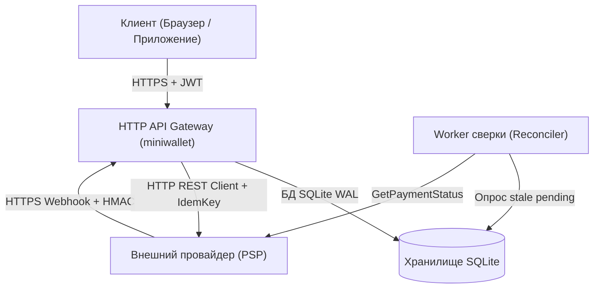

# Модель угроз miniwallet (STRIDE Threat Model)

Документ описывает архитектурный анализ безопасности платёжного ядра `miniwallet` по методологии Microsoft STRIDE.

---

## 1. Архитектурный контекст и границы доверия

### Границы доверия (Trust Boundaries)
1. **Клиент -> API**: Недоверенная зона. Вся входная полезная нагрузка валидируется, `user_id` извлекается строго из проверенной подписи JWT токена.
2. **Провайдер -> API (Вебхуки)**: Входящие вызовы подлежат строгой криптографической верификации HMAC-SHA256 и фильтрации таймстемпов.
3. **API -> Провайдер (Исходящие вызовы)**: Защита исходящих вызовов семафором, circuit breaker, retry budget и идемпотентным ключом `pay-<payment_id>`.
4. **Ядро -> База данных SQLite**: Защита от гонок и неконсистентности через `BEGIN IMMEDIATE`, транзакционный арбитраж уникальности `(user_id, idempotency_key)` и частичный индекс на один успешный платёж на заказ.

---

## 2. Анализ угроз STRIDE

### 2.1 Spoofing (Подделка личности)
* **Угроза**: Подделка заголовка `X-User-ID` или поля `user_id` в теле запроса для создания платежей или изменения заказов от имени другого пользователя (BOLA / IDOR).
  * **Реализация защиты**: В `JWTMiddleware` заголовок `X-User-ID` и тело `user_id` полностью игнорируются. Идентификатор пользователя извлекается исключительно из валидированного JWT токена (`claims.UserID`).
* **Угроза**: Подделка входящего вебхука об успешной оплате от имени платёжного шлюза.
  * **Реализация защиты**: Метод `VerifyWebhookSignature` проверяет HMAC-SHA256 подпись по сырому телу запроса с конкатенацией таймстемпа (`timestamp.rawBody`) через `hmac.Equal` (защита от time-leak attacks). Окно дрейфа времени ограничено `±5 минут` для защиты от replay-атак. Поддерживаются два одновременных секрета для бесшовной ротации.

### 2.2 Tampering (Фальсификация данных)
* **Угроза**: Манипуляция суммой или валютой через вебхук (например, отправка `payment.succeeded` с суммой 10 KZT вместо 100 000 KZT).
  * **Реализация защиты**: Сумма и валюта из вебхука сверяются строго с полями `payment.AmountMinor` и `payment.Currency` из БД. При расхождении генерируется ошибка `domain.ErrWebhookAmountMismatch`, транзакция коммитит событие безопасности в `security_events` и дедупликацию в `webhook_events`, но статус платежа и заказа не меняется.
* **Угроза**: Подмена идентификатора транзакции провайдера (`ProviderPaymentID`).
  * **Реализация защиты**: Если у платежа уже зафиксирован `ProviderPaymentID`, а вебхук пришёл с другим ID, коммитится аудит `security.provider_id_mismatch`, изменение статуса отклоняется.

### 2.3 Repudiation (Отказ от авторства)
* **Угроза**: Невозможность подтвердить или расследовать транзакционные переходы и аномалии.
  * **Реализация защиты**:
    * Полный аудит переходов жизненного цикла в таблице `payment_events` (`from_status`, `to_status`, `event_type`, `metadata`, `created_at`).
    * Сохранение всех входящих вебхуков в таблице `webhook_events` (`event_id`, `event_type`, сырой `payload`).
    * Фиксация инцидентов безопасности в таблице `security_events` (`payment_id`, `event_type`, `metadata`).

### 2.4 Information Disclosure (Утечка информации)
* **Угроза**: Перебор чужих `order_id` (Enumeration) для сбора информации о заказах.
  * **Реализация защиты**: При обращении к чужому заказу возвращается `domain.ErrOrderNotFound` (HTTP 404), идентично обращению к несуществующему заказу. Разница во времени ответа нивелирована быстрыми транзакциями БД.
* **Угроза**: Утечка структуры БД или внутренних трейсов ошибок.
  * **Реализация защиты**: Централизованный маппинг ошибок в `writeDomainError` с унифицированным JSON-конвертом `{ "error": { "code": "...", "message": "..." } }`. Внутренние ошибки БД возвращаются клиенту как `500 internal_error` без раскрытия стека.

### 2.5 Denial of Service (Отказ в обслуживании)
* **Угроза**: Истощение пула горутин и соединений БД при зависании провайдера.
  * **Реализация защиты**:
    * Ограничение параллельных запросов к шлюзу через `provider.Semaphore` (лимит 20 параллельных сетевых соединений).
    * `CircuitBreaker`: после 5 последовательных сбоев переходит в состояние `Open` и мгновенно отсекает запросы с HTTP 503 (`ErrCircuitOpen`), предотвращая лавинообразную деградацию.
    * Retry Budget с защитой от бесконечных повторов при исчерпании тайм-бюджета запроса.
* **Угроза**: DoS атака на API через спам запросов.
  * **Реализация защиты**: Независимые лимитеры Token Bucket: на IP (100 rps, burst 200), на User ID (20 rps, burst 40), на вебхуки (50 rps, burst 100).
  * `httpapi.NewHTTPServer` настроен с жёсткими таймаутами (`ReadHeaderTimeout: 2s`, `ReadTimeout: 10s`, `WriteTimeout: 15s`, `IdleTimeout: 60s`, `MaxHeaderBytes: 1MB`).

### 2.6 Elevation of Privilege (Повышение привилегий)
* **Угроза**: Создание платежей заблокированными пользователями или попытка повторного использования использованных сессий.
  * **Реализация защиты**: Проверка флагов `is_active` и `is_blocked` пользователя. Строгий контроль конечного автомата состояний (`PaymentStatus.CanTransitionTo`).
